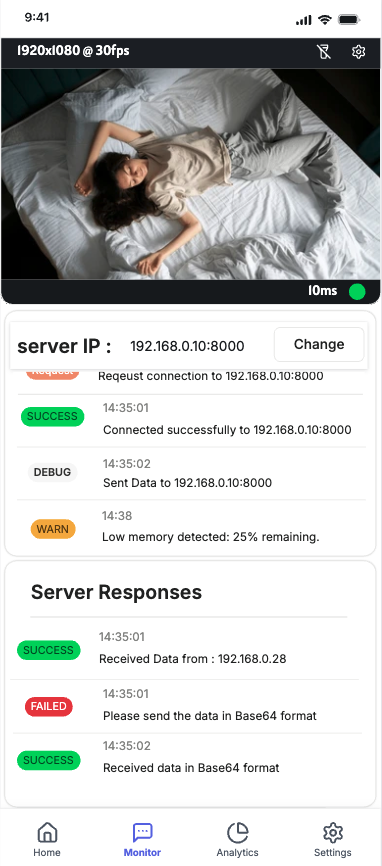

<div align="center">
<h1>MoJI Application</h1>
</div>

<div style="display: flex; align-items: center;">
  <div style="flex: 1; padding-right: 20px;">
    <p>
      This React Native app, developed for the Smart Pillow Project, captures a person's presence and transmits the data to an AI server for analysis.
    </p>
  </div>
  <div style="flex: 1;">
    
  </div>
</div>


# Getting Started
React Native : 0.75.4  
react-native-vision-camera : 4.6.4  
react-native-worklets-core : 1.6.0  

## Step 1: Install Dependecies

Due to GitHub's upload size limitations, the dependencies for this project ahve been removed. Please make sure to install them before running the project.
```
npm install
```
## Step 2: Start Metro

First, you will need to run Metro, the JavaScript build tool for React Native.

To start the Metro dev server, run the following command from the root of your React Native project:
```
# Using npm
npm start

# OR using Yarn
yarn start
```
## Step 3: Build and run your app

With Metro running, open a new terminal window/pane from the root of your React Native project, and use one of the following commands to build and run your Android or iOS app:
### Android
```
# Using npx
npx react-native run-android

# OR using Yarn
yarn android
```
### iOS

For iOS, remember to install CocoaPods dependencies (this only needs to be run on first clone or after updating native deps).

The first time you create a new project, run the Ruby bundler to install CocoaPods itself:
```
bundle install

Then, and every time you update your native dependencies, run:

bundle exec pod install
```
For more information, please visit CocoaPods Getting Started guide.
```
# Using npm
npm run ios

# OR using Yarn
yarn ios
```
If everything is set up correctly, you should see your new app running in the Android Emulator, iOS Simulator, or your connected device.

This is one way to run your app — you can also build it directly from Android Studio or Xcode.
